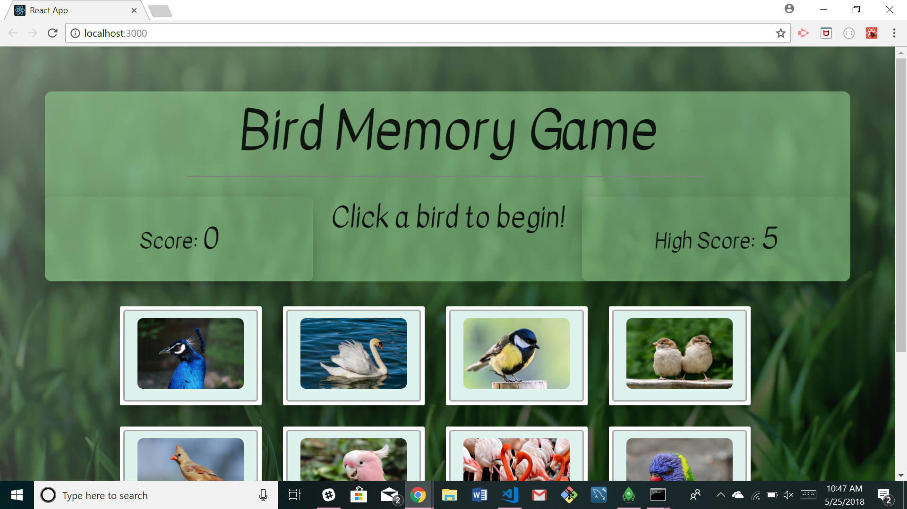
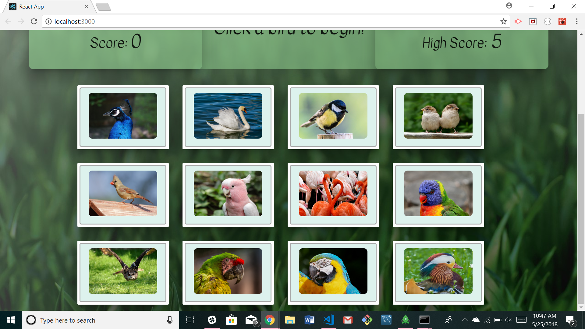

# ClickyGame

This project was created by Jaime Halupka as a requirement for homework during University of Central Florida's Coding Bootcamp. 

### Screenshots

Main Screen

Bird Photos

  
### Description

This application uses React to render a game where the user is invited to click on a bird image. They then must continue to click on bird images without clicking on the same photo twice. Photos are shuffled after each click. If you can click on all 12 without duplication, you win.

### Link to Application

[Heroku Link](https://)

### GIFs

[GIF Link](https://gfycat.com/gifs/detail/ComfortableAccomplishedAlligator)

